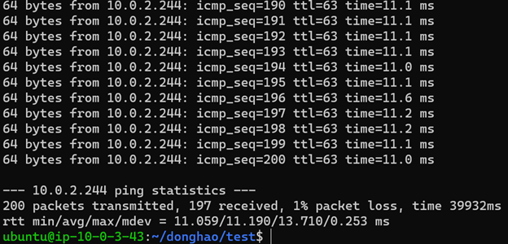

# EE542 Team Projects - LAB - 04


### Dev Environment:

- **OS**: Ubuntu 18.04, vyos 1.3
- **Compiler**: g++ ver. 5.4.0

---

### External libraries installations

- Open ssl

Execute this command in the terminal:

```shell
sudo apt-get install openssl
sudo apt-get install libpcap-dev libssl-dev
```

---

### Introductions to our File Transfer Protocol

In the ftp protocols designed by us, the main idea is to use UDP to transfer to partitioned file packets and to emulate
TCP's ACK machenism to make sure the packets are transferred correctly. We also added TCP-like flow controls to send
multiple packets continously and to get ACKs continously to obtain a higher sending rate.

#### UDP and TCP hybrid Transfer

As is acknowledged, compared to TCP protocol, UDP is a much faster, simpler, and efficient protocol, however,
retransmission of lost data packets is only possible with TCP. Secure copy (scp) command in Linux system is used to copy
file(s) between servers in a secure way, and it is based on the Secure Shell (SSH) protocol, which is usually running
over TCP protocol.

TCP can have multiple features which guarantee its reliablity, security, congestion controls and flow controls, but these can also make TCP's throughput slower compared to UDP. UDP's connectionless, simplicity and efficiency can be a better choice to build a ftp protocol on under some networks circumstances. Therefore, we chose to combine UDP and TCP to build our ftp protocol.

#### Source Codes file structures

The table below shows the main files, their descriptions and their dependencies for this lab assignment.

|File name|Type|Descriptions|Dependencies|
|---|---|---|---|
|**basis.h**| C++ header file | Declarations for all classes for the server end and the client end| md5.h|
|**md5.h**| C++ header file| Encapsulation for MD5 check funtions|openssl/md5.h|
|**server.cpp**|C++ source codes|Implemations for classes and functions at the server end|LinkNode.h|
|**client.cpp**|C++ source codes|Implemations for classes and functions at the client end|LinkNode.h|

#### Server end functions

In our designing, the server is the receiving side who will be listening and receiving the files sent from the clients. To launch the server, it will open up a UDP socket and listen on a specified port number (*default 60001*), and a TCP socket and listen on a specified port number (*default 60003*).

When a client is launched and sending packets to the server, the server will then react to the client. The first packet sent by the client through **TCP socket** is an initial packet and it will cover these infomations:

- The file size
- The packet size
- The number of packets that the client is about to send
- The name of the file

After obtaining the file's fundamental informations, the server will initiate a memory space accroding to the file size,
where the transferred parts of the file will be written into, and the server also send back a ACK packet.

Then, the transmission is started. The server will continously receive the client's packets. Every packet will have
these fields defined by us:

- **MD5 check field**: storing MD5 checking codes
- **Stream field**: reserved field for multithreads processing
- **Offset field**: storing the packet index number in the whole file data
- **Data field**: storing the file data

After receiving such a packet from the client, the server will firstly calculate the data's MD5 code and compare it with the received MD5 field, if it is not correct, the server will ask the client to resend the packet. If the MD5 check is passed, the server will write the data into the memory space according to the packet offset number and record the packet's offset index.

When the received packets number reach the whole number of the planned packets, the transmission is ended and the server
will save the file data to the hard drive and calculate the whole duration and the whole throughput for this
transmission.

#### Client end functions

At the client side, all the functions are corresponding to what happened on the server end as we described above. Firstly, the client will read the file data, partition it and encapsulate them into packets according to the packet size we set. And the client will initiate a UDP socket(*default portnum 60002*) and a TCP socket(*default portnum 60004*). And then the client will send an initial packet over TCP socket to the server to inform the transmission informations, as mentioned above.

After sending the initial packet, the Client will then **continously send packets to the server multiple times(*default 3 times*) without any stopping until all packets are sent**. Then the client will wait for the un-ACKed packets offset index list over TCP socket. And the client will resend the packets that are not ACK-ed and do it in a loop until there are not un-ACKed packets returned from the server.

After making sure all the packets are ACK-ed, the client can stop the transmission and close the sockets.

#### UDP sending and TCP confirming mechanisms

As you can nitice from the above descriptions, the key idea in our protocol is using UDP to continuously send packets and using TCP to pass the ACK information between the client and the server sides. There are several reasons for doing this:

- The main time-consuming job in this file transfer protocol is transferring the file data packets. That's why we use UDP to do this part, because UDP is fast and simple.
- Since we choose UDP to transfer the main data, there must be data loss in between. So we have to acknowledge the sender about the loss and the sender can arrange the re-sending process.
- For the acknowledging part, we choose TCP because we want to make sure this information is correct no matter how bad the networks enviroment is. The ACK corruption can always be a troubling problem and TCP can solve this issue.

The process of this part can be described as: 

- Both the client and the server are aware of the total number of packets that are about to be sent.
- At the first round of loop, the client send all the packets one by one for multiple times over UDP without worrying about if the packets are delievered. And at the server side, the server will continously listen to the UDP socket and collect the UDP packets. When one packet is confirmed, the server will record the index of this packet.
- After the first round of loop, the server will calculate all the packet indices that are not confirmed (ACK-ed) and send the list back to the client.
- When the client receives the un-ACKed list, it will enter the next round of the loop and send the un-ACKed packets for multiple times over UDP again.
- The Server and Client will repeat the step 2, 3, 4 until the un-ACKed list is finally empty, which means all the packets are confirmed by the server.

In this way, we can obtain a larger throughput on the data transferring using UDP socket and guarantee the reliabilty using TCP confirming mechanisms.

---

### Compile and run the programs

To compile the codes, please execute these commands:

```shell
g++ server.cpp -o server -std=c++11 -lssl -lcrypto
g++ client.cpp -o client -std=c++11 -lssl -lcrypto
```

To run the programs, on the Server end:

```shell
./server
```

On the client end:

```shell
./client <Server Ip address> <File name>
```

---

### File transfer experiments under different networks enviroments

#### Case - 1: RTT 10ms, 1% loss, 100Mbits/sec

##### Networks enviroment configuring commands

client:

```shell
sudo tc qdisc add dev eth1 root tbf rate 100mbit latency 0.001ms burst 9015
```

Ensure that the rate limiting is working by executing iperf:   
MTU1500:   
   
   
MTU9000:   
   


server:

```shell
sudo tc qdisc add dev eth0 root tbf rate 100mbit latency 0.001ms burst 9015
```

vyos:

```shell
sudo tc qdisc add dev eth0 root handle 1:0 tbf rate 100mbit latency 0.001ms burst 9015
sudo tc qdisc add dev eth1 root handle 1:0 tbf rate 100mbit latency 0.001ms burst 9015
sudo tc qdisc add dev eth0 parent 1:1 handle 10: netem delay 5ms drop 1%
sudo tc qdisc add dev eth1 parent 1:1 handle 10: netem delay 5ms drop 1%
```

##### Networks measurement results using iPerf3 and ping
|MTU|TCP throughput| RTT| Loss|
|---|---|---|---|
|1500|15.6 Mbps|11.190 ms|3.8 %|
|9000|14.27 Mbps|11.169 ms|4.1 %|

Screenshots: 

Ping:   
MTU1500:   
   
   
MTU9000:   
   


iperf drop rate in UDP:   
MTU1500:   
   
   
MTU9000:   
   


iPerf TCP throughput:   
MTU1500:   
   
   
MTU9000:   
   


##### Experiments results

||scp  - MTU 1500| scp  - MTU 9000| ours - MTU 1500|ours - MTU 9000|
|---|---|---|---|---|
|**File size**|1024 MB|1024 MB|1024 MB|1024 MB|
|**Duration**|546 secs|687 secs|642 secs|172 secs|
|**Throughput**|15.00 Mbps|11.92 Mbps|12.76 Mbps|47.62 Mbps|

MTU 1500 terminal output:


MTU 9000 terminal output:


##### Results analysis

In case 1, the networks between the server and the client have a low RTT and a low packet loss rate. Our ftp is obviously faster than scp, because of the efficiency of UDP transfer and our TCP confirming mechanisms. 

Since there is not much disturbance on the networks, most of the packets are delivered at the first round of UDP tansfer, because the probability of loss of a single packet over three times' duplicate sending is pretty low. And we only have to resend the remaining packets during the rounds of loops and the file is then transferred.

#### Case - 2: RTT 200ms, 20% loss, 100Mbits/sec

##### Networks enviroment configuring commands

client:

```shell
sudo tc qdisc add dev eth1 root tbf rate 100mbit latency 0.001ms burst 9015
```

server:

```shell
sudo tc qdisc add dev eth0 root tbf rate 100mbit latency 0.001ms burst 9015
```

vyos:

```shell
sudo tc qdisc add dev eth0 root handle 1:0 tbf rate 100mbit latency 0.001ms burst 9015
sudo tc qdisc add dev eth1 root handle 1:0 tbf rate 100mbit latency 0.001ms burst 9015
sudo tc qdisc change dev eth0 parent 1:1 handle 10: netem delay 100ms drop 20%
sudo tc qdisc change dev eth1 parent 1:1 handle 10: netem delay 100ms drop 20%
```

##### Networks measurement results using iPerf3 and ping
|MTU|TCP throughput| RTT| Loss|
|---|---|---|---|
|1500|160.67 Kbps|201.208 ms|22 %|
|9000|121.94 Kbps|201.186 ms|22 %|

Screenshots: 

Ping:   
MTU1500:   
   
   
MTU9000:   
   


iperf drop rate in UDP:   
MTU1500:   
   
   
MTU9000:   
   


iPerf TCP throughput:   
MTU1500:   
   
   
MTU9000:   
   


##### Experiments results

||scp  - MTU 1500|scp  - MTU 9000| ours - MTU 1500|ours - MTU 9000|
|---|---|---|---|---|
|**File size**|1024 MB|1024 MB|1024 MB|1024 MB|
|**Duration**|Too long|237168|NA|8731 secs|
|**Throughput**|Too small|34.5 Kbps|NA|1.008 Mbps|

MTU 1500 terminal output:


MTU 9000 terminal output:


##### Results analysis

In case 2, the networks environments are relatively bad and both the RTT and Loss are much higher than the case 1. The throughput of our ftp is lower than the optimal situations. There are several facts which can lower our ftp's performance.

- **RTT**: In our protocol, RTT cannot affect the UDP transfer because UDP need not the receiver's confirm when sending a packet. However, higher RTT can slower the confirming sending procedure and TCP transfer. **On one hand**, everytime the receiver waits for a UDP packet, it will set a timer for the waiting process. If the sender is still sending, the timer should never hit timeout. But once the receiver gets a timeout, it knows that the sender has done sending and it is time for the receiver to arrange a un-ACKed list and send it back to the sender. If the RTT between the networks are higher, everytime the receiver will wait for longer time for the UDP packets and decide whether to send the confirming list back. Since this process can be repeated for thousands of times, RTT can massively affect our ftp's throughput. **On the other hand**, also, the TCP transfer can be affected by the RTT because of TCP's ACK machenism. But since TCP transfer is not used heavily in our ftp, this fact can be a minor reason.
- **Loss**: The most obviously reason why the loss rate can affect our ftp is that, when we are sending the file packets, we use UPD and hope for a higher probability that more packets are delivered and confirmed. The loss rate can exactly affect this step. With a higher loss rate on the networks, the probability that a certain number of packets are delivered is much lower. And this low probability means that we have to send back the un-ACKed list for more times and resend the unconfirmed packets for more times. Therefore, the loss rate over the networks can lower our ftp's performance.

#### Case3: RTT 200ms, NO loss, 80Mbits/sec

client:

```shell
sudo tc qdisc add dev eth1 root tbf rate 100mbit latency 0.001ms burst 9015
```

server:

```shell
sudo tc qdisc add dev eth0 root tbf rate 100mbit latency 0.001ms burst 9015
```

vyos:

```shell
sudo tc qdisc add dev eth0 root handle 1:0 tbf rate 80mbit latency 0.001ms burst 9015
sudo tc qdisc add dev eth1 root handle 1:0 tbf rate 80mbit latency 0.001ms burst 9015
sudo tc qdisc add dev eth0 parent 1:1 handle 10: netem delay 100ms
sudo tc qdisc add dev eth1 parent 1:1 handle 10: netem delay 100ms
```

##### Networks measurement results using iPerf3 and ping
|MTU|TCP throughput| RTT| Loss|
|---|---|---|---|
|1500|0.870 Kbps|201.308 ms|24 %|
|9000|0.878 Mbps|201.176 ms|25 %|

Screenshots:   


iperf drop rate in UDP:   
MTU1500:   
   
   
MTU9000:   
   


iPerf TCP throughput:   
MTU1500:   
   
MTU9000:   
   


##### Experiments results

||scp  - MTU 1500|scp  - MTU 9000| ours - MTU 1500|ours - MTU 9000|
|---|---|---|---|---|
|**File size**|1024MB|1024MB|1024MB|1024MB|
|**Duration**|331|12677|922 secs|241|
|**Throughput**|24.75 Mbps|0.65 Mbps|8.89 Mbps|33.99 Mbps|

MTU 1500 terminal output:


MTU 9000 terminal output:


##### Result analysis

In case three, there is no loss over the networks but the bandwidth is lower. From the results, we can see that our ftp still maintain a good performance. 

When the TCP is working over a lower-bandwidth link, the throughput of TCP can be lowered too, because of TCP's ACK mechanism and its flow control. But if the UDP is working over a lower-bandwidth link, it will still send as many packets as it can, but more packets will be dropped because of the bandwidth. In our ftp, UDP's dropping rate can be easily compensated by the TCP confirming mechanism, the TCP is not heavily used in our ftp. Therefore, lower bandwidth cannot affect our ftp that much.

Further more, from the case 2, we can find that our ftp is much more sensitive to the loss rate over the networks. Therefore, with no loss over the link, our ftp can obtain a much better performance.

---

### Conclusions

In this lab, we developed a file transfer protocol based on TCP and UDP socket communications. The main idea for our ftp is to use UDP to transfer the data partitioned packets and to use TCP to confirm the packets deliveries. We combined these two kind of sockets and utilized their advantages respectively, e.g. UDP's efficiency and TCP's reliabilty.The result shows that our ftp is faster than the scp protocol and can maintain its performance to some degree under various networks circumstances.

There are still some functions that we can optimize in our ftp to obtain a higher throughput:

- We can use a **dynamic confirming window size** (un-ACKed list size which is sent back to the sender) which can be adjusted automatically according to the networks' environments.
- We can set a **dynamic wait time** for the receiver to receive the UDP packets. 
- We can use multi threads to receive and to send packets. Also, the multi threads can also be used to receive & write or to read & send simultaneously.

That's it for our Lab-04. See you on the next lab!

---

**✌Fight on Trojans!**
